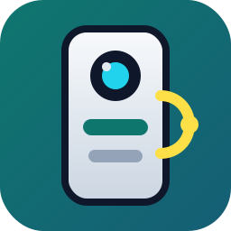

# WelcomeEye Local

  

  Local control and cloud event monitoring for WelcomeEye Connect 3 intercoms from Home Assistant.

  
  

## Features

- **Local Unlock**: Open the **latch** (gâche) and the **gate** (portail) directly via the local device API. No cloud latency for opening.
- **Cloud Watcher**: Monitor events (doorbell rings, badge unlocks, app unlocks) via a robust polling mechanism.
- **Dedicated Entities**: 
    - Binary Sensor for the doorbell.
    - Buttons and Locks for opening latch and gate.
    - Sensors for the last event type, unlock method, and badge ID.
    - Manual refresh button to trigger an instant event check.

## Installation

### HACS (Recommended)

1. **Click the HACS badge above** to open this repository directly in your HACS instance.
2. Or manually add this repository as a **Custom Repository** in HACS (Integration category).
3. Install **WelcomeEye Local**.
4. Restart Home Assistant.
5. **Click the Config Flow badge above** or go to `Settings -> Devices & Services -> Add Integration` and search for **WelcomeEye**.

## Configuration

The integration supports three modes of operation:

### 1. Hybrid Mode (Recommended)
Fill in both Local and Cloud information to get full control and real-time monitoring.

### 2. Local-only Mode
Provide only the **Intercom IP** and **Local Code**.
- ✅ Open latch and gate.
- ❌ No doorbell or badge event monitoring.

### 3. Cloud-only (Watcher) Mode
Provide only the **Cloud Email**, **Password**, and **Intercom ID (CID)**.
- ✅ Doorbell and badge event monitoring.
- ❌ Cannot open doors (requires local network access).

### Fields detail:
- **Intercom IP**: Local IP address of your monitor.
- **Local Code**: The 6-digit code you configured on the monitor screen.
- **Cloud Email & Password**: Your Philips WelcomeEye app credentials.
- **Intercom ID / CID**: The unique ID of your intercom (found in the app settings, e.g., `2502uvs...`).
- **Poll Frequency**: How often to check for events (in minutes, set to 0 to disable automatic polling).

## Entities

- **Binary Sensor**: `Doorbell` (turns on for 10 seconds when someone rings).
- **Button / Lock**: `Open Latch` (Gâche).
- **Button / Lock**: `Open Gate` (Portail).
- **Button**: `Refresh Events` (Manual poll).
- **Sensor**: `Last Event Type`.
- **Sensor**: `Last Unlock Method`.
- **Sensor**: `Last Badge ID`.

## Support

- Issues: [GitHub Issues](https://github.com/titom43/welcomeeye-ha-workspace/issues)
